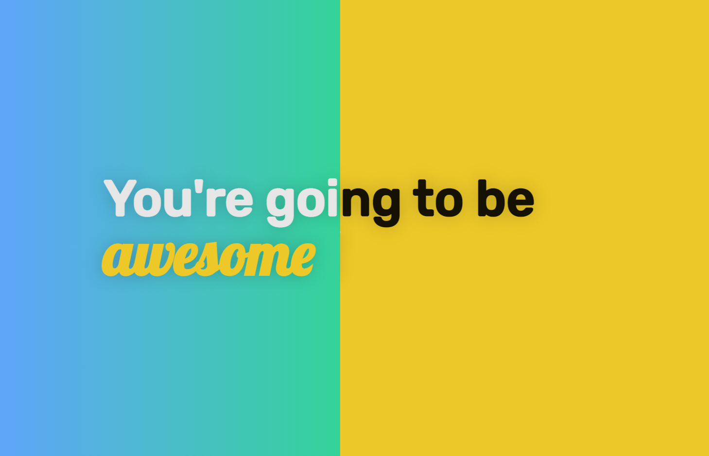

## Revealing header

> Header has two tiles absolutely positioned, that reveal each other.



Featuring:

- Absolutely position our containers on top of each other.
- With the left-side we change the width based on the mouse position.

```js
const left = document.getElementById("left-side");
/* Here we define a mouse listener to handle the sliding of the left-side
container over the other via mouse movement. First we need the `width` in
percentage based on mouse position, compared to window `innerWidth`. */
const handleSlide = (e) => {
  const { clientX } = e;
  const { innerWidth } = window;
  const percentage = (clientX / innerWidth) * 100;
  // ...
  console.log({ clientX, innerWidth }); // These property values give,
  console.log("=", percentage, "%"); // <-- our percentage :)
  // ...
  // Update our left-side container width:
  left.style.width = `${percentage}%`;
};
document.onmousemove = (e) => handleSlide(e);
document.ontouchmove = (e) => handleSlide(e.touches[0]); // For mobile
```

Regards, <br />
Luigi Lupini <br />
<br />
I ❤️ all things (🇮🇹 / 🛵 / ☕️ / 👨‍👩‍👧)<br />
